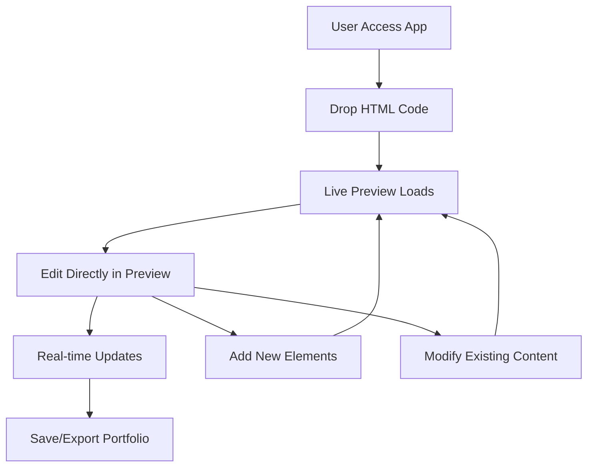

# LikeDocs - No-Code Portfolio Builder

## Overview

LikeDocs is a revolutionary no-code web application that empowers users to create stunning portfolios without any programming knowledge. Built on Next.js, it provides an intuitive drag-and-drop interface where users can import HTML code and edit it directly through a live preview system.

## 🎯 Target Audience

- **Designers & Creatives**: Portfolio creation without coding barriers
- **Professionals**: Quick portfolio setup for career advancement
- **Students**: Easy portfolio building for academic and job applications
- **Non-technical Users**: Anyone needing a professional online presence

## 🚀 Key Features

### Core Functionality

- **No-Code Interface**: Create portfolios without writing a single line of code
- **HTML Drop Functionality**: Import existing HTML templates or code snippets
- **Live Preview**: See changes instantly as you edit
- **Direct Editing**: Modify content directly from the preview interface
- **Real-time Updates**: Immediate reflection of all changes

### User Experience

- **Intuitive Interface**: Drag-and-drop simplicity
- **Visual Editing**: WYSIWYG (What You See Is What You Get) editing
- **Responsive Design**: Portfolios work on all devices
- **Export Options**: Save and download completed portfolios

## 🔄 User Flow



### Step-by-Step Process

1. **Initial Setup**

   - User accesses the LikeDocs application
   - Clean, intuitive interface welcomes the user

2. **Content Import**

   - User drops HTML code into the designated area
   - System parses and validates the HTML
   - Live preview generates instantly

3. **Live Editing**

   - User clicks on any element in the preview
   - Direct editing mode activates
   - Changes appear in real-time

4. **Customization**

   - Modify text, images, links, and styling
   - Add new sections or remove unwanted content
   - Rearrange layout elements as needed

5. **Finalization**
   - Preview final portfolio
   - Export as HTML file
   - Save project for future editing

## 🛠 Technical Architecture

### Frontend Stack

- **React 19.1.0**: Modern component-based UI
- **Next.js 15.5.0**: Full-stack framework with SSR capabilities
- **TypeScript 5**: Type-safe development
- **Tailwind CSS 4**: Utility-first styling
- **ESLint 9**: Code quality and consistency

### Key Components

#### 1. HTML Parser & Sanitizer

- Safely processes user-provided HTML
- Prevents XSS attacks and malicious code
- Maintains clean, valid HTML structure

#### 2. Live Preview Engine

- Real-time rendering of HTML content
- Interactive editing capabilities
- Responsive design preview

#### 3. Editor Interface

- Direct manipulation of preview elements
- Context-sensitive editing tools
- Drag-and-drop functionality

#### 4. Export System

- Clean HTML generation
- CSS optimization
- File download capabilities

## 🎨 Design Principles

### User-Centric Design

- **Simplicity**: Minimal learning curve
- **Accessibility**: Usable by people of all technical levels
- **Speed**: Quick portfolio creation process
- **Flexibility**: Customizable to individual needs

### Technical Excellence

- **Performance**: Fast loading and responsive editing
- **Security**: Safe handling of user content
- **Reliability**: Consistent, bug-free experience
- **Scalability**: Handles portfolios of various sizes

## 🔒 Security Considerations

### HTML Sanitization

- Strip malicious scripts and dangerous elements
- Whitelist safe HTML tags and attributes
- Prevent injection attacks

### Content Validation

- Verify HTML structure integrity
- Check for suspicious code patterns
- Ensure safe rendering in preview

### Data Protection

- Secure handling of user portfolios
- Privacy-focused design
- No unnecessary data collection

## 📋 Development Roadmap

### Phase 1: Core Foundation

- [x] Next.js application setup
- [ ] HTML parser implementation
- [ ] Basic live preview system
- [ ] Simple editing interface

### Phase 2: Enhanced Editing

- [ ] Advanced editing tools
- [ ] Drag-and-drop interface
- [ ] Component library
- [ ] Template gallery

### Phase 3: Advanced Features

- [ ] Custom CSS editor
- [ ] Image upload and management
- [ ] SEO optimization tools
- [ ] Analytics integration

### Phase 4: Platform Features

- [ ] User accounts and project saving
- [ ] Collaboration tools
- [ ] Portfolio hosting
- [ ] Custom domain support

## 🚀 Getting Started

### Prerequisites

- Node.js (compatible with React 19 and Next.js 15)
- Package manager (npm, yarn, pnpm, or bun)
- Modern web browser

### Installation

```bash
# Clone the repository
git clone [repository-url]

# Navigate to project directory
cd likedocs

# Install dependencies
npm install

# Start development server
npm run dev
```

### Development Commands

```bash
# Start development server
npm run dev

# Build for production
npm run build

# Start production server
npm run start

# Run linting
npm run lint
```

## 🌟 Benefits

### For Users

- **No Technical Barriers**: Create professional portfolios without coding
- **Time Efficient**: Quick setup and editing process
- **Cost Effective**: Free alternative to expensive portfolio builders
- **Complete Control**: Full customization of design and content

### For Developers

- **Modern Stack**: Built with latest web technologies
- **Extensible**: Easy to add new features and components
- **Maintainable**: Clean, well-structured codebase
- **Scalable**: Designed to handle growth and feature expansion

## 📄 License

This project is open source and available under the [MIT License](LICENSE).

## 🤝 Contributing

We welcome contributions from the community! Please read our contributing guidelines and submit pull requests for any improvements.

## 📞 Support

For questions, issues, or feature requests, please open an issue in the GitHub repository or contact our support team.

---

**LikeDocs** - Empowering everyone to create beautiful portfolios without code.
